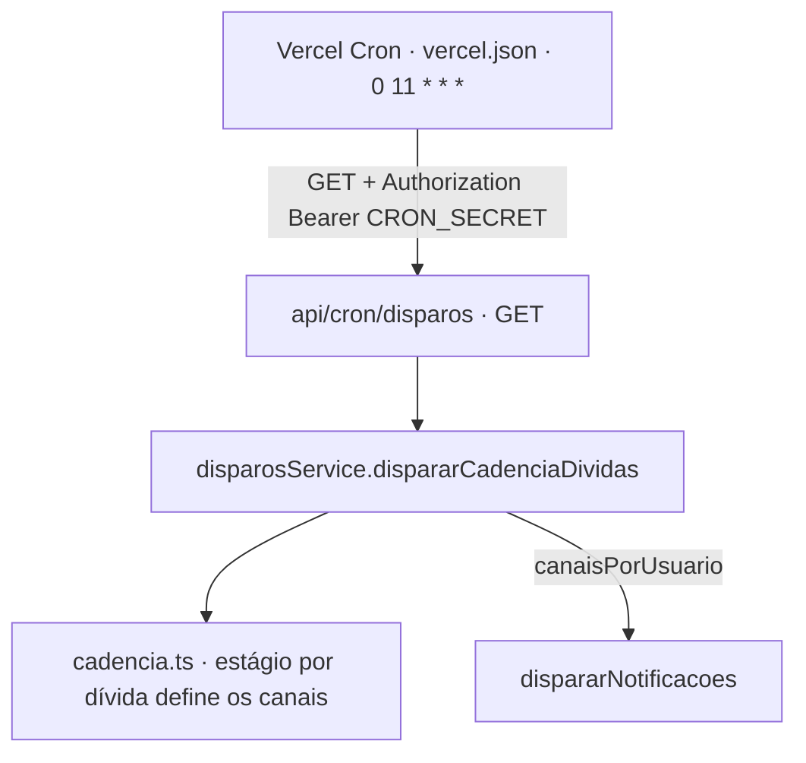
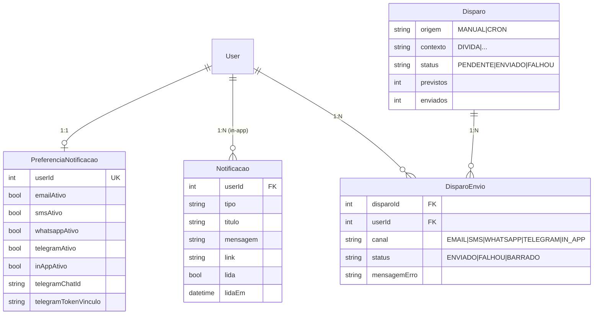

# Sistema de Notificações — Documentação (junho/2026)

Esta documentação descreve **o que está de fato no código hoje**: arquitetura, fluxo de chamadas,
onde as preferências do usuário são salvas e verificadas, como funciona a central in-app (sino),
o status real de cada provedor de envio e o modelo de dados.

---

## 1. Visão geral e domínios

O sistema é dividido em **dois domínios** com responsabilidades distintas:

| Domínio | Pasta | Responsabilidade |
|---|---|---|
| **Disparos** (motor de envio) | `src/core/disparos/` | Providers, cadência, orquestração e logs de lote (`Disparo`/`DisparoEnvio`). |
| **Notificações** (usuário) | `src/core/notificacoes/` | Preferências de canal, vínculo do Telegram e central in-app (o sino). |

São **5 canais** suportados de ponta a ponta:

```
EMAIL | SMS | WHATSAPP | TELEGRAM | IN_APP
```

> O tipo canônico é `CanalEnvio` em [`src/core/disparos/types.ts`](../src/core/disparos/types.ts).

---

## 2. Fluxo "quem chama o quê"

### 2.1. Disparo manual (tela admin)

```mermaid
graph TD
    UI[page.tsx /sistema/disparos] --> HK[useNotificacoes]
    HK -->|POST canais, dias, usuarioIds| RT[api/sistema/disparos · executarDisparo (só admin)]
    RT --> SV[disparosService.dispararNotificacoes]
    SV --> PG[obterPendenciasGeral · 2 queries]
    SV --> PR[notificacoesRepository.obterPreferenciasEmLote]
    SV -->|chunks de 20, Promise.all| EU[enviarUm por usuário × canal]
    EU -->|canal externo| PROV{Provider}
    EU -->|canal IN_APP| INAPP[notificacoesService.criar → linha em notificacao]
    EU --> SLU[salvarLogUsuario → 1 DisparoEnvio]
    SV --> FIN[finalizarLogPrincipal → fecha o Disparo]
```

**Arquivos:**
- UI: [`page.tsx`](../src/app/(Private)/sistema/disparos/page.tsx) +
  [`hooks/useNotificacoes.ts`](<../src/app/(Private)/sistema/disparos/hooks/useNotificacoes.ts>)
- Rota: [`api/sistema/disparos/route.ts`](../src/app/api/sistema/disparos/route.ts) → `executarDisparo`
- Orquestrador: [`core/disparos/service.ts`](../src/core/disparos/service.ts) → `dispararNotificacoes`

**Modos da tela:**
- **"Enviar teste para mim"** → `apenasAdmin: true`. Envia só para o admin logado e usa
  `ignorarPreferencias: true` (não respeita as preferências — é teste de homologação).
- **"Disparar para selecionados"** → envia para os `usuarioIds` marcados, **respeitando as
  preferências** de cada um.

### 2.2. Disparo automático (Vercel Cron)



- Agendamento: [`vercel.json`](../vercel.json) → `0 11 * * *` (1×/dia, 08h BRT).
- Rota protegida por `Authorization: Bearer ${CRON_SECRET}` (header injetado pela Vercel).
- A **cadência** ([`cadencia.ts`](../src/core/disparos/cadencia.ts)) é a **única fonte de verdade**:
  para cada dívida, o `diasParaVencer` casa um estágio que define **por quais canais** notificar.
  Vários estágios do mesmo dia para o mesmo usuário são consolidados em **1 mensagem por canal**.
  O detalhamento completo da **regra dos 9 ciclos** está na **Seção 7**.

### 2.3. Vínculo do Telegram

```mermaid
graph TD
    P[perfil → "Conectar Telegram"] --> GL[gerarLinkTelegram]
    GL --> RL[api/notificacoes/preferencias/telegram/link]
    RL -->|grava telegramTokenVinculo| DB[(preferencia_notificacao)]
    RL --> DL[deep link t.me/&lt;bot&gt;?start=&lt;token&gt;]
    DL --> TG[usuário toca "Iniciar" no Telegram]
    TG -->|POST update| WH[api/telegram/webhook]
    WH --> VT[vincularTelegram(token, chatId)]
    VT -->|grava telegramChatId + telegramAtivo=true| DB
```

O webhook valida o header `x-telegram-bot-api-secret-token` contra `TELEGRAM_WEBHOOK_SECRET`.

### 2.4. Preferências e central in-app

- Preferências: perfil → `GET/PATCH /api/notificacoes/preferencias`.
- Central in-app (sino): header → `GET /api/notificacoes`, `PATCH /api/notificacoes/[id]/lida`,
  `POST /api/notificacoes/marcar-todas-lidas`.

---

## 3. Permissões aceitas pelo usuário — onde salva e onde verifica

> **Pergunta-chave:** "o usuário X concedeu receber notificação por tal canal — onde isso é salvo e
> verificado? É um `IN()` na query?"

### Onde é **salvo**
Na tabela **`preferencia_notificacao`** (model `PreferenciaNotificacao`,
[`prisma/schemas/notificacao.prisma`](../prisma/schemas/notificacao.prisma)) — relação **1:1** com
`user` (`userId @unique`). Um boolean por canal + dados do Telegram:

| Campo | Significado |
|---|---|
| `emailAtivo` | default `true` |
| `inAppAtivo` | default `true` |
| `smsAtivo` / `whatsappAtivo` / `telegramAtivo` | default `false` (opt-in) |
| `telegramChatId` | chat vinculado (necessário para enviar via Telegram) |
| `telegramTokenVinculo` | token temporário do fluxo de vínculo |

Quando o usuário ainda não tem registro, vale o `PREFERENCIA_PADRAO`
([`notificacoes/service.ts`](../src/core/notificacoes/service.ts)): e-mail + in-app ligados, o resto
desligado.

### Onde é **verificado**
**Não** é um `IN()` no SQL de filtragem. É uma **consulta prévia em lote** + **decisão em memória**:

1. **Consulta prévia (1 query):** `notificacoesRepository.obterPreferenciasEmLote(userIds)` faz
   `findMany({ where: { userId: { in: userIds } } })` e devolve um `Map<userId, preferencia>`.
   (Aqui sim existe um `in`, mas para **carregar** as preferências de todos de uma vez — não para
   filtrar o disparo.)
2. **Decisão por (usuário × canal), em memória:** `notificacoesService.canalHabilitado(pref, canal)`:
   - usa o boolean do canal (ou o `PREFERENCIA_PADRAO` quando não há registro);
   - para **TELEGRAM**, exige também `telegramChatId` vinculado.
3. **Resultado:** se o canal estiver desabilitado, o envio daquele usuário naquele canal é marcado
   como **`BARRADO`** no `disparo_envio` (não conta como falha; não chama o provedor).

A mesma função `canalHabilitado` alimenta dois lugares — garantindo coerência:
- o **envio** (`dispararNotificacoes`, status `BARRADO`);
- a **UI admin**: a rota `GET /api/sistema/disparos` anexa `canaisHabilitados` por usuário, e a tela
  mostra ícones de canal (verde = habilitado / cinza = desativado) e um aviso quando um canal
  selecionado para disparo está barrado para aquele destinatário.

> Exceção: "Enviar teste para mim" passa `ignorarPreferencias = true` e pula essa verificação.

---

## 4. Central in-app (o sino)

- O canal **`IN_APP` não tem provedor externo**. Em `dispararNotificacoes`, quando o canal é
  `IN_APP`, em vez de chamar um provider chama-se `notificacoesService.criar(...)`, que insere uma
  linha na tabela **`notificacao`**
  ([`core/disparos/service.ts`](../src/core/disparos/service.ts)).
- O sino [`Notification.tsx`](<../src/app/(Private)/layout/vertical/header/Notification.tsx>) faz
  **polling a cada 60s** (`GET /api/notificacoes`), exibindo a lista (`listarDoUsuario`) e o badge de
  não-lidas (`contarNaoLidas`).
- **"Marcar como lida"** (`/[id]/lida`) e **"Marcar todas"** (`/marcar-todas-lidas`) fazem
  `updateMany` setando `lida = true, lidaEm = now()`. O badge mostra `count(lida = false)`; ao clicar
  numa notificação com `link`, navega para a rota e a marca como lida.
- Cada `Notificacao` tem `tipo` (ex.: `DIVIDA`), `titulo`, `mensagem`, `link` opcional. O conteúdo do
  in-app reaproveita o **texto curto** (mesmo formato do SMS).

---

## 5. Provedores de envio — status real

> ⚠️ Versões antigas desta doc citavam **Twilio** para SMS/WhatsApp. **Está incorreto.** O código
> atual usa **Comtele** (SMS) e **Meta WhatsApp Cloud API** (WhatsApp).

| Canal | Provedor | Status | Variáveis de ambiente |
|---|---|---|---|
| **E-mail** | SMTP (Gmail/Nodemailer) **ou** Resend | ✅ **Funcionando** (com fallback mock) | `SMTP_HOST`, `SMTP_PORT`, `SMTP_SECURE`, `SMTP_USER`, `SMTP_PASS`, `SMTP_FROM` **ou** `RESEND_API_KEY`, `EMAIL_FROM` |
| **Telegram** | Telegram Bot API (oficial, gratuito) | ✅ **Funcionando** (mock sem token) | `TELEGRAM_BOT_TOKEN`, `TELEGRAM_BOT_USERNAME`, `TELEGRAM_WEBHOOK_SECRET` |
| **In-App** | — (grava no banco) | ✅ **Funcionando** (sempre) | nenhuma |
| **SMS** | Comtele (REST nacional) | ⚠️ **Inerte** | `COMTELE_API_KEY`, `COMTELE_SENDER` |
| **WhatsApp** | Meta WhatsApp Cloud API | ⚠️ **Inerte** | `WHATSAPP_TOKEN`, `WHATSAPP_PHONE_NUMBER_ID`, `WHATSAPP_TEMPLATE_NAME` |

**Sobre os canais inertes (Comtele/Meta):** o código está pronto, porém a **chamada HTTP real está
comentada** ([`sms.provider.ts`](../src/core/disparos/providers/sms.provider.ts),
[`whatsapp.provider.ts`](../src/core/disparos/providers/whatsapp.provider.ts)). Sem as envs, o
provider apenas loga e retorna sucesso (no-op seguro, não quebra a cadência). Por isso aparecem como
**"Experimental"** na UI. Para ativar:
- **SMS (Comtele):** inserir `COMTELE_API_KEY`/`COMTELE_SENDER` e descomentar o bloco marcado com 🔑.
- **WhatsApp (Meta):** criar/verificar a WABA, número dedicado e **template "utility" aprovado**,
  inserir as 3 envs e descomentar o bloco 🔑. Mensagens proativas exigem template aprovado.

**Sem chaves (desenvolvimento):** E-mail, SMS, WhatsApp e Telegram caem em **modo mock** (logam no
terminal e retornam sucesso); o In-App sempre grava de verdade.

---

## 6. Formatação por canal

`formatarMensagem` ([`service.ts`](../src/core/disparos/service.ts)) escolhe o formato pelo canal:

- **SMS / IN_APP:** texto curto e direto (resumo consolidado, sem markdown).
- **WHATSAPP / TELEGRAM:** texto com markdown (negrito, bullets, emojis).
- **EMAIL:** HTML estruturado (cards de vencidas/a vencer, subtotais e botão para o painel).

A pré-visualização da tela admin
([`buildPreview.ts`](<../src/app/(Private)/sistema/disparos/components/buildPreview.ts>)) espelha
exatamente esses formatos.

---

## 7. Cadência de dívidas — a regra dos 9 ciclos

O **cron** (Seção 2.2) não dispara "para todo mundo todo dia". Ele segue uma **cadência escalonada**
de 9 estágios (ciclos), definida em [`cadencia.ts`](../src/core/disparos/cadencia.ts) — a **única
fonte de verdade**. Para ajustar custo/frequência, edita-se **só** esse array.

### 7.1. Os 9 ciclos

Cada item é `{ dias, stage, canais }`, onde `dias` é o **offset em relação ao vencimento**
(positivo = antes de vencer, `0` = no dia, negativo = em atraso):

| # | `dias` | Estágio | Canais | Quando dispara |
|---|---|---|---|---|
| 1 | `7`  | `pre_aviso`  | EMAIL, TELEGRAM, IN_APP | 7 dias **antes** de vencer |
| 2 | `3`  | `lembrete`   | EMAIL, TELEGRAM, IN_APP | 3 dias antes |
| 3 | `1`  | `vespera`    | WHATSAPP, EMAIL, IN_APP | véspera |
| 4 | `0`  | `vence_hoje` | WHATSAPP, EMAIL, IN_APP | no dia do vencimento |
| 5 | `-1` | `atrasou`    | EMAIL, TELEGRAM, IN_APP | 1 dia em atraso |
| 6 | `-3` | `cobranca_1` | EMAIL, TELEGRAM, IN_APP | 3 dias em atraso |
| 7 | `-7` | `cobranca_2` | EMAIL, TELEGRAM, IN_APP | 7 dias em atraso |
| 8 | `-15`| `critico`    | EMAIL, TELEGRAM, SMS, IN_APP | 15 dias em atraso |
| 9 | `-30`| `final`      | EMAIL, TELEGRAM, SMS, IN_APP | 30 dias em atraso |

> Observação de custo embutida na regra: os canais **caros** entram só onde fazem diferença —
> **WhatsApp** apenas na véspera/vencimento (D-1, D0) e **SMS** apenas nos estágios mais graves
> (D+15, D+30). E-mail, Telegram e In-App (gratuitos) cobrem todos os ciclos.

### 7.2. Como um ciclo é "disparado" — casamento exato

O cron roda **1×/dia**. Para cada dívida, calcula-se o `diasParaVencer` e chama-se
`estagioDoAlerta(diasParaVencer)`:

```ts
export function estagioDoAlerta(diasParaVencer: number) {
  return CADENCIA.find((c) => c.dias === diasParaVencer) ?? null;
}
```

A comparação é por **igualdade exata** (`c.dias === diasParaVencer`). Ou seja, uma dívida só gera
notificação **nos dias exatos** `7, 3, 1, 0, -1, -3, -7, -15, -30`. Em qualquer outro dia
(ex.: faltando 5 dias, ou 4 dias em atraso) **não há disparo** para aquela dívida. É isso que
mantém o volume (e o custo) sob controle: nada de mandar mensagem todo santo dia.

### 7.3. Consolidação por usuário (1 mensagem por canal)

`dispararCadenciaDividas` ([`service.ts`](../src/core/disparos/service.ts)) monta, para cada usuário,
o **conjunto (set) de canais** somando os estágios que casaram hoje entre **todas** as dívidas dele:

```text
para cada usuário com pendência:
    canais = Set()
    para cada dívida (vencidas + a vencer):
        estagio = estagioDoAlerta(dívida.diasParaVencer)
        se estagio: canais.add(...estagio.canais)
    se canais não vazio: canaisPorUsuario[usuário] = Array(canais)
```

Assim, se o usuário tem 2 dívidas batendo ciclos diferentes no mesmo dia (uma em `pre_aviso`, outra
em `critico`), os canais são **unidos** e ele recebe **1 mensagem por canal** (não uma por dívida).
A mensagem em si lista todas as pendências (vencidas + a vencer) — ver Seção 6.

### 7.4. Onde a janela de 7 dias entra

`dispararCadenciaDividas` lê as pendências com `obterPendenciasGeral(7)`. A janela **7** garante
cobrir os estágios futuros (D-7 … D0); as dívidas **já vencidas** (dias < 0) sempre vêm todas,
independentemente da janela. O casamento exato de `estagioDoAlerta` é quem decide, ao final, se cada
dívida realmente dispara hoje.

### 7.5. Preferências continuam valendo

A cadência define os canais **antes** do filtro de preferências. Depois, no envio
(`dispararNotificacoes`), cada (usuário × canal) ainda passa por `canalHabilitado` (Seção 3): se o
usuário desativou aquele canal, o envio vira **`BARRADO`**. Ou seja, a cadência **propõe**, a
preferência do usuário **dispõe**.

> **Para alterar a regra:** edite o array `CADENCIA` (adicionar/remover ciclos, trocar offsets ou
> canais). Nenhum outro arquivo precisa mudar — `estagioDoAlerta` e `dispararCadenciaDividas`
> consomem o array dinamicamente.

---

## 8. Modelo de dados e relacionamentos



- **`Disparo`** = um **lote** (um disparo manual ou uma execução do cron). Guarda `previstos`,
  `enviados` e `status` geral.
- **`DisparoEnvio`** = o **detalhe** de cada (usuário × canal), com `status`
  `ENVIADO | FALHOU | BARRADO`. É o que o modal "Destinatários do Disparo" lista.

Schemas: [`disparo.prisma`](../prisma/schemas/disparo.prisma),
[`notificacao.prisma`](../prisma/schemas/notificacao.prisma).

---

## 9. Performance e limites (escala)

### 9.1. Leitura otimizada
`obterPendenciasGeral` lê **todas** as pendências em **2 queries** (usuários ativos + 1 CTE geral de
despesas) e agrupa por usuário em memória (`Map`). O custo no banco é praticamente **constante**,
independente do número de usuários.

### 9.2. Envio em lotes paralelos
O envio roda em **chunks** de `CHUNK_SIZE = 20` usuários; dentro de cada lote os envios
(usuário × canal) vão em `Promise.all` (paralelo). O tempo do lote ≈ o tempo de **um** envio.

### 9.3. Timeout
- A rota do cron usa `maxDuration = 300` (Fluid Compute, Hobby) — folga grande para e-mail em lote.
- O paralelismo **reduz o tempo**, mas **não remove o teto de 300s** por invocação. Para dezenas de
  milhares de usuários, dividir em **várias invocações** (fila no banco + cron em lotes, Inngest ou
  QStash) — ver abaixo.

### 9.4. Custos e rate limit dos provedores
- **E-mail SMTP (Gmail):** ~500/dia grátis. **Resend:** 3.000/mês (100/dia); domínio próprio para
  não cair em spam.
- **SMS (Comtele) / WhatsApp (Meta):** cobram **por mensagem/conversa**; sem desconto por lote.
  WhatsApp proativo exige **template aprovado**. Atenção a **rate limit** ao disparar em massa
  (reduzir `CHUNK_SIZE` se necessário).
- **Telegram:** gratuito e sem custo por mensagem (respeitar limites de flood do bot).

### 9.5. Estratégia para escala (quando necessário)
Fila no próprio Neon + Vercel Cron em lotes pequenos (status `PENDENTE` → processa N por execução),
ou serviços de fila serverless (Inngest / Upstash QStash). Cada execução processa poucas mensagens e
nunca estoura o timeout.

---

## 10. Mapa rápido de arquivos

| Camada | Caminho |
|---|---|
| UI disparos (admin) | `src/app/(Private)/sistema/disparos/` |
| UI perfil/preferências | `src/app/(Private)/dashboard/perfil/page.tsx` |
| Sino (header) | `src/app/(Private)/layout/vertical/header/Notification.tsx` |
| Rota disparo manual | `src/app/api/sistema/disparos/route.ts` |
| Rota cron | `src/app/api/cron/disparos/route.ts` |
| Rotas in-app/preferências | `src/app/api/notificacoes/**` |
| Webhook Telegram | `src/app/api/telegram/webhook/route.ts` |
| Motor de envio | `src/core/disparos/{service,repository,cadencia,types}.ts` |
| Providers | `src/core/disparos/providers/{email,sms,whatsapp,telegram}.provider.ts` |
| Domínio do usuário | `src/core/notificacoes/{service,repository,dto}.ts` |
| Schemas Prisma | `prisma/schemas/{disparo,notificacao,user}.prisma` |
</content>
