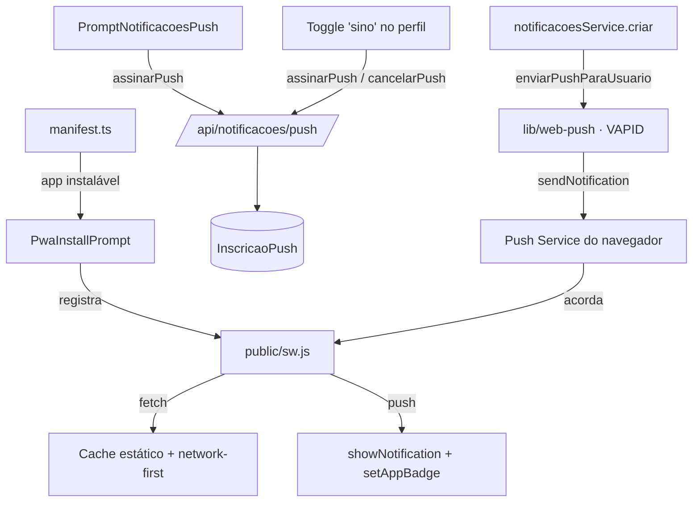
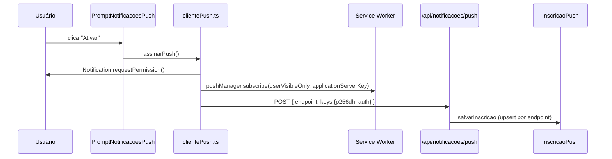

# PWA do MagicBox — Documentação (junho/2026)

Esta documentação descreve **o que está de fato no código hoje** sobre o Progressive Web App:
manifest, service worker, instalação, Web Push (VAPID) e o badge no ícone — incluindo
**as validações de cada etapa**. Complementa a [documentação de notificações](./notificacoes_documentacao.md):
aqui é o "transporte" (PWA/push); lá é o "conteúdo" (canais, preferências, sino).

---

## 1. Visão geral

O MagicBox é um PWA instalável que entrega:

| Capacidade | Onde vive | Precisa estar instalado? | Precisa de VAPID? |
|---|---|---|---|
| Instalação na tela inicial | `manifest.ts` + `PwaInstallPrompt` | — | ❌ |
| Cache / acesso offline | `public/sw.js` (fetch) | ❌ (mas ideal) | ❌ |
| Badge com **app aberto** | `Notification.tsx` (`setAppBadge`) | parcial¹ | ❌ |
| Notificação + badge com **app fechado** | Web Push (`sw.js` + backend) | ✅ | ✅ |

> ¹ A Badging API funciona melhor com o app instalado; no navegador comum o badge não aparece.



---

## 2. Manifest — [`src/app/manifest.ts`](../src/app/manifest.ts)

Gerado pelo Next.js (App Router) e servido em **`/manifest.webmanifest`**. O Next injeta
automaticamente o `<link rel="manifest">` no HTML — não há tag manual no layout.

Pontos relevantes:
- `display: "standalone"` → abre sem a barra do navegador (cara de app nativo). É o que habilita
  o critério `display-mode: standalone` usado nas validações de instalação/push.
- `start_url: "/"`, `theme_color: "#5D87FF"` (alinhado ao Primary do tema).
- Ícones em `purpose: "any"` **e** `maskable` (adaptam-se ao recorte do Android).

**Validação crítica:** o [`middleware.ts`](../src/middleware.ts) **libera `/manifest.webmanifest` sem
autenticação** (linha ~35 e no `matcher`). Sem isso, o manifest cairia no redirect de login e o app
não seria instalável.

---

## 3. Service Worker — [`public/sw.js`](../public/sw.js)

Arquivo único, sem plugin (sem `next-pwa`/`serwist`). Cache atual: **`magicbox-cache-v2`**.

### 3.1. Ciclo de vida e cache
- `install`: pré-cacheia `/`, `/favicon.ico`, `/images/logos/logo.png` + `skipWaiting()`.
- `activate`: apaga caches de versões antigas + `clients.claim()`.
- `fetch`:
  - **Cache-first** para estáticos (`/_next/static/`, `/images/`, `.js/.css/.svg/.png/.ico/.woff2`).
  - **Network-first** para páginas/APIs; em falha, cai no cache; navegação HTML sem cache → `/`.
  - **Validações:** ignora requisições não-`GET` e de outras origens (ex.: extensões).

> ⚠️ Ao mudar o `sw.js`, **suba a versão do cache** (`v2` → `v3`) para forçar o `activate` a limpar o antigo.

### 3.2. Push (app fechado) — handler `push`
1. Faz `event.data.json()` → `{ titulo, mensagem, link, naoLidas }` (com fallback para texto puro).
2. `showNotification(titulo, { body, icon, badge, tag, data:{link} })` — **obrigatório no Android**
   (todo push precisa exibir notificação; não existe push silencioso).
3. `setAppBadge(naoLidas)` / `clearAppBadge()` — **validado** por `"setAppBadge" in self.navigator`.

### 3.3. Clique — handler `notificationclick`
Fecha a notificação e foca uma aba já aberta do app (`clients.matchAll` + `navigate`) ou abre o
`link` com `openWindow`.

### 3.4. Registro do SW
Feito em [`PwaInstallPrompt.tsx`](../src/components/shared/PwaInstallPrompt.tsx), **após o `load`**
(para não pesar no carregamento). **Validação importante:** só registra quando
`status === "authenticated"` — ou seja, SW/cache/push só valem **depois do login**.

---

## 4. Prompt de instalação — [`PwaInstallPrompt.tsx`](../src/components/shared/PwaInstallPrompt.tsx)

Card que sugere instalar o app. Validações para aparecer:
- `status === "authenticated"`;
- **não** já instalado (`display-mode: standalone` ou `navigator.standalone`);
- não dispensado nas últimas **24h** (`localStorage["pwa-prompt-dismissed"]`);
- captura `beforeinstallprompt` (Android/Chrome) → botão "Instalar";
- **iOS**: sem `beforeinstallprompt`, mostra instruções manuais (Compartilhar → Adicionar à Tela).

---

## 5. Web Push e VAPID

### 5.1. O que é VAPID e por que precisa
Seu servidor não fala direto com o dispositivo — fala com o **Push Service do navegador**
(Chrome→FCM, Firefox→Mozilla, Safari→Apple). O **VAPID** (RFC 8292) autentica o seu servidor
perante esse serviço, evitando que qualquer um envie push em nome do app.

### 5.2. As três variáveis (e o que há *dentro* delas)
As chaves são um **par ECDSA na curva P-256 (prime256v1)**, em base64url. Geradas com
`npx web-push generate-vapid-keys`:

| Variável | Exposição | Conteúdo exato | Papel | Onde é usado |
|---|---|---|---|---|
| `NEXT_PUBLIC_VAPID_PUBLIC_KEY` | **pública** (client) | 65 bytes: `0x04` + `X`(32) + `Y`(32) = ponto não-comprimido na P-256 (87 chars b64url) | `applicationServerKey` no `subscribe`; o Push Service usa para **verificar** a assinatura | [`src/utils/push/clientePush.ts:4`](../src/utils/push/clientePush.ts#L4) (lê env) e no `assinarPush` (passa a string base64url direto ao `pushManager.subscribe`) |
| `VAPID_PRIVATE_KEY` | **secreta** (server) | 32 bytes: o escalar privado `d` da P-256 (43 chars b64url) | **assina** o JWT de cada envio (autentica servidor perante Push Service) | [`src/lib/web-push.ts:16`](../src/lib/web-push.ts#L16) (lê env) e [`:22`](../src/lib/web-push.ts#L22) (passa ao `webpush.setVapidDetails`) |
| `VAPID_SUBJECT` | server | `mailto:` ou URL `https://` de contato | exigido pelo protocolo (canal de contato p/ abuso) | [`src/lib/web-push.ts:17`](../src/lib/web-push.ts#L17) (lê env) e [`:22`](../src/lib/web-push.ts#L22) (passa ao `webpush.setVapidDetails`) |

> A pública e a privada são **um par**: a privada assina, a pública (carimbada na inscrição) verifica.
> Expor a pública é seguro e proposital; a segurança vem da privada.

**Fluxo de execução:**
- **Client (navegador)**: `NEXT_PUBLIC_VAPID_PUBLIC_KEY` (em `clientePush.ts`) → `pushManager.subscribe(applicationServerKey)` → envia endpoint+chaves ao backend.
- **Server (Node)**: `VAPID_PRIVATE_KEY` + `VAPID_SUBJECT` (em `web-push.ts`) → `setVapidDetails` → [`webpush.sendNotification`](../src/core/notificacoes/push.ts#L36) usa para assinar JWT → Push Service verifica assinatura com a pública.

### 5.2.1 Rastreamento detalhado de cada chave

#### **`NEXT_PUBLIC_VAPID_PUBLIC_KEY`** (pública, no client)

```
Fluxo de inscrição:
1. [PromptNotificacoesPush.tsx]
   └─> user clica "Ativar"
2. [clientePush.ts:4]
   └─> const VAPID_PUBLIC_KEY = process.env.NEXT_PUBLIC_VAPID_PUBLIC_KEY
3. [clientePush.ts]
   └─> pushManager.subscribe({
       applicationServerKey: VAPID_PUBLIC_KEY, // base64url direto (sem conversão)
       userVisibleOnly: true
     })
4. Push Service (FCM/Mozilla/Apple) → carimbos a inscrição com a pública
5. [/api/notificacoes/push]
   └─> POST { endpoint, keys: {p256dh, auth} } → salva em InscricaoPush
```

#### **`VAPID_PRIVATE_KEY`** (privada, no server)

```
Fluxo de envio:
1. [notificacoesService.criar]
   └─> cria notificação in-app
2. [notificacoesService.criar] (continuação)
   └─> enviarPushParaUsuario(userId, payload)
3. [push.ts:36]
   └─> webpush.sendNotification({ endpoint, keys }, payload)
       ↓ (internamente no web-push)
4. [web-push.ts:22] setVapidDetails foi chamado antes
   └─> web-push JÁ tem a VAPID_PRIVATE_KEY configurada
5. web-push assina um JWT com a privada
6. POST /send ao Push Service (FCM/Mozilla/Apple)
   ├─ Header: Authorization: vapid t=<JWT>, k=<publicKey>
   └─ Push Service valida JWT com a pública que foi carimba­da na inscrição
7. Push Service "acorda" o SW do dispositivo
8. [public/sw.js] handler push dispara
```

#### **`VAPID_SUBJECT`** (contato, no server)

```
Configuração:
1. [web-push.ts:17]
   └─> const subject = process.env.VAPID_SUBJECT || "mailto:contato@magicbox.app"
2. [web-push.ts:22]
   └─> webpush.setVapidDetails(subject, publicKey, privateKey)
3. Dentro de cada JWT enviado, o `subject` aparece como claim
   └─ Push Service o lê e pode usar como contato em caso de abuso
```

**Resumo visual:**
```
┌─────────────────┐
│ Client          │
│ pushManager.    │ ← NEXT_PUBLIC_VAPID_PUBLIC_KEY
│ subscribe({     │
│  applicationKey │
│ })              │
└────────┬────────┘
         │ POST /api/notificacoes/push
         ↓
┌─────────────────┐
│ Backend         │
│ webpush.        │
│ sendNotification│ ← VAPID_PRIVATE_KEY + VAPID_SUBJECT
│ (endpoint, jwt) │
└────────┬────────┘
         │ POST /send ao Push Service
         ↓
┌─────────────────┐
│ Push Service    │
│ (FCM/Mozilla)   │
│ valida JWT com  │ ← verificação com NEXT_PUBLIC_VAPID_PUBLIC_KEY
│ pública         │
└─────────────────┘
```

### 5.3. Configuração — [`src/lib/web-push.ts`](../src/lib/web-push.ts)
Configura `webpush.setVapidDetails(subject, public, private)` **uma vez**. **Validação (modo no-op):**
sem as chaves, `pushConfigurado = false` e o envio é ignorado em silêncio — o app **não quebra**,
só fica sem push.

### 5.4. Fluxo de inscrição (opt-in)


[`PromptNotificacoesPush.tsx`](../src/components/shared/PromptNotificacoesPush.tsx) — validações para aparecer:
`authenticated` + `pushSuportado()` + permissão **ainda não concedida** (`Notification.permission !== "granted"`).
Aparece **instalado ou em aba comum** (não exige standalone) e **reavalia a cada troca de rota**
(via `usePathname`, pois o componente fica montado na raiz e não remonta ao navegar). "Agora não"
**silencia por 1h** (`localStorage["push-prompt-dispensado"]`, `COOLDOWN_MS = 60min`); depois volta
a aparecer ao navegar enquanto a permissão não for concedida. Some definitivamente quando a permissão
vira `granted`. Há também o caminho manual pelo **toggle "No aplicativo (sino)"** no perfil
([`perfil/page.tsx`](<../src/app/(Private)/dashboard/perfil/page.tsx>)), que ao ligar chama
`assinarPush()` (pede permissão + inscreve) e ao desligar chama `cancelarPush()`.

[`clientePush.ts`](../src/utils/push/clientePush.ts) — `pushSuportado()` valida
`serviceWorker` + `PushManager` + `Notification`; passa a chave VAPID **base64url direto** ao
`applicationServerKey` (a Push API aceita string, sem conversão para `Uint8Array`);
reaproveita inscrição existente; `cancelarPush()` remove no backend e dá `unsubscribe()`.

[`/api/notificacoes/push`](../src/app/api/notificacoes/push/route.ts) — `POST`/`DELETE` com
`getAuthUser` + validação **Zod** (`endpoint` URL, `keys.p256dh`/`auth` não-vazios).

### 5.5. Fluxo de envio
Acoplado à criação do in-app: [`notificacoesService.criar`](../src/core/notificacoes/service.ts)
→ conta não lidas → [`enviarPushParaUsuario`](../src/core/notificacoes/push.ts). É **aguardado**
de propósito (serverless mata fire-and-forget). **Best effort**: nunca lança; inscrições mortas
(**404/410**) são removidas automaticamente.

---

## 6. Badge no ícone (Badging API)

| Cenário | Onde | Como |
|---|---|---|
| App **aberto** (foreground) | [`Notification.tsx`](<../src/app/(Private)/layout/vertical/header/Notification.tsx>) | `useEffect` em `naoLidas` → `setAppBadge`/`clearAppBadge` |
| App **fechado** (background) | [`public/sw.js`](../public/sw.js) handler `push` | `setAppBadge(naoLidas)` vindo do payload |

**Validação comum:** sempre guardado por `"setAppBadge" in navigator`. O **número** exibido depende
da launcher (Samsung One UI mostra contagem; muitas mostram só um ponto) — é decisão do SO.

---

## 7. Matriz de suporte

| Plataforma | Instalar | Push (fechado) | Badge |
|---|---|---|---|
| Android Chrome (instalado) | ✅ | ✅ | ✅ (número varia por launcher) |
| Chrome/Edge desktop (instalado) | ✅ | ✅ | ✅ número |
| iOS/iPadOS 16.4+ (instalado) | ✅ manual | ✅ (permissão via gesto) | ✅ |
| Navegador (não instalado) | — | ❌ | ❌ |

Requisitos transversais: **HTTPS** (prod/Vercel ok) e **usuário logado** (o SW só registra autenticado).

---

## 8. Checklist de produção (Vercel)

1. **Env vars** no projeto: `NEXT_PUBLIC_VAPID_PUBLIC_KEY`, `VAPID_PRIVATE_KEY`, `VAPID_SUBJECT`
   (as mesmas do `.env.local`; nunca commitar a privada).
2. **Commitar a migration** `prisma/migrations/20260622000000_adicionar_inscricao_push/`
   (a Vercel aplica via `migrate deploy` no build — ver [handbook de migrations](./prisma_migrations_handbook.md)).
3. Teste real: instalar no Android Chrome → ativar notificações → **fechar o app** → disparar
   (canal `IN_APP`) → conferir notificação na bandeja + badge.

---

## 9. Mapa de arquivos

| Camada | Arquivo |
|---|---|
| Manifest | `src/app/manifest.ts` |
| Service Worker | `public/sw.js` |
| Liberação no middleware | `src/middleware.ts` (whitelist de `sw.js`/`manifest.webmanifest`) |
| Prompt de instalação | `src/components/shared/PwaInstallPrompt.tsx` |
| Prompt de push (opt-in) | `src/components/shared/PromptNotificacoesPush.tsx` |
| Opt-in manual (toggle "sino") | `src/app/(Private)/dashboard/perfil/page.tsx` (`togglePref` → `assinarPush`/`cancelarPush`) |
| Helper push (client) | `src/utils/push/clientePush.ts` |
| Config VAPID (server) | `src/lib/web-push.ts` |
| Envio de push | `src/core/notificacoes/push.ts` |
| Hook na criação | `src/core/notificacoes/service.ts` (`criar`) |
| API de inscrição | `src/app/api/notificacoes/push/route.ts` |
| Modelo de dados | `prisma/schemas/notificacao.prisma` (`InscricaoPush`) |
| Badge foreground | `src/app/(Private)/layout/vertical/header/Notification.tsx` |
