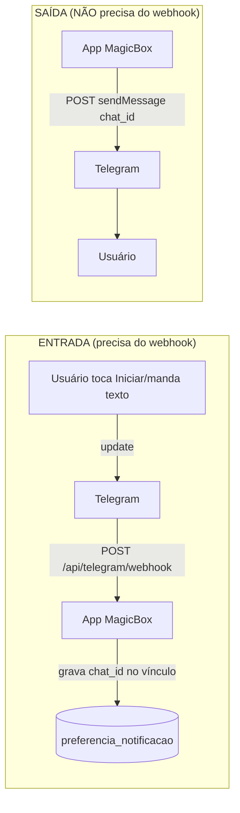
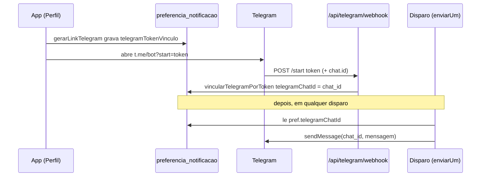

# Bot do Telegram — Guia Completo (MagicBox)

Tudo o que você precisa entender sobre o bot `@magicbox_fin_bot`: o que é necessário, o papel do
webhook, os critérios para enviar mensagens, e como ele pode evoluir de "notificador" para um
**chatbot de finanças**.

---

## 1. O que é necessário para ter um bot

Um bot do Telegram é só uma conta especial controlada por um **token**. Para funcionar de verdade,
você precisa de **duas vias** independentes:

| Via | Direção | O que exige |
|---|---|---|
| **Enviar** mensagens | seu app → Telegram | Só o **token** + o **`chat_id`** do usuário (e o usuário ter dado `/start` antes). |
| **Receber** mensagens | Telegram → seu app | Um meio de o Telegram te entregar os updates: **webhook** (push) **ou** `getUpdates` (polling). |

Resumindo, o mínimo é:
1. **Bot criado no @BotFather** → gera o `TELEGRAM_BOT_TOKEN`.
2. Para **receber** (ex.: capturar o `/start` no vínculo): **webhook** com URL pública HTTPS
   (no nosso caso serverless, é o caminho certo — ver Seção 3).
3. Para **enviar**: o `chat_id` do destinatário, obtido **depois** que ele iniciou o bot.

> Não precisa de servidor próprio, Docker ou VPS. O bot "mora" no Telegram; seu app só fala com a
> API `https://api.telegram.org/bot<TOKEN>/<método>`.

---

## 2. BotFather = interface visual sobre a Bot API

Tudo que o **@BotFather** edita (nome, descrição, "about", comandos) são chamadas à **mesma Bot API**
que o nosso código usa. Por isso, quando configuramos via `curl`, **apareceu já preenchido** no
`/mybots` → *Edit Bot*. Equivalências:

| O que você vê no BotFather | Método da Bot API | Onde aparece para o usuário |
|---|---|---|
| **Edit Description** | `setMyDescription` | Tela do chat **vazio**, antes do `/start` ("What can this bot do?") |
| **Edit About** | `setMyShortDescription` | **Página de perfil** do bot (texto curto, ≤120 caracteres) |
| **Edit Commands** | `setMyCommands` | Menu de comandos (o botão "/" no chat) |
| **Edit Name** | `setMyName` | Nome exibido |
| **Edit Botpic** | ❌ (não existe na Bot API) | Foto de perfil — **só** pelo BotFather |

**Estado atual** (já configurado via API):
- Description: "Bot oficial do MagicBox 💜 … Toque em INICIAR para vincular sua conta."
- About: "Lembretes financeiros do MagicBox direto no Telegram."
- Commands: `start - Vincular minha conta ao MagicBox`
- Botpic: **pendente** (enviar imagem quadrada via BotFather → *Edit Botpic*).

---

## 3. O webhook — o que é e por que existe

### 3.1. Duas formas de receber updates
O Telegram não "empurra" mensagens sozinho. Você escolhe **como** recebê-las:

- **`getUpdates` (polling):** seu servidor fica perguntando "tem novidade?" num loop. Exige um
  processo **sempre ligado** → **não combina** com serverless (Vercel).
- **`setWebhook` (push):** você registra uma URL pública; o Telegram faz um **HTTP POST** nessa URL a
  cada novo update. É **event-driven**, perfeito para serverless. **É o que usamos.**

### 3.2. Fluxo (entrada vs saída)



- **Sem webhook**, o app nunca descobre o `chat_id` do usuário → o vínculo não se completa → você não
  tem para quem enviar. **Enviar**, em si, não depende do webhook (é uma chamada direta).
- O webhook é validado por um **secret** (`TELEGRAM_WEBHOOK_SECRET`): o Telegram manda o header
  `x-telegram-bot-api-secret-token` e a rota recusa quem não bater
  ([webhook/route.ts](../src/app/api/telegram/webhook/route.ts)).

### 3.3. Como registrar o webhook
Helper do projeto ([scripts/telegram-webhook.mjs](../scripts/telegram-webhook.mjs)):
```bash
yarn telegram:webhook set https://SUA_URL_PUBLICA   # registra
yarn telegram:webhook info                          # confere (url + last_error)
yarn telegram:webhook delete                         # remove
```

- **Local (dev):** precisa de uma URL pública apontando para o `localhost:3000`. Sem instalar nada,
  via SSH:
  ```bash
  ssh -R 80:localhost:3000 nokey@localhost.run   # imprime https://xxxx.lhr.life
  ```
  (Alternativa estável: `yay -S cloudflared-bin` → `cloudflared tunnel --url http://localhost:3000`.)
  A cada novo túnel a URL muda → rode `set` de novo.
- **Produção (Vercel):** a URL é fixa (seu domínio). Registra-se **uma vez**:
  `yarn telegram:webhook set https://seu-dominio.vercel.app`.

> ⚠️ Só **um** webhook por bot. Se registrar a URL de produção, o local para de receber (e vice-versa).
> Para desenvolver, aponte para o túnel; ao terminar, re-aponte para produção.

---

## 4. Critérios para ENVIAR mensagens (e por que é grátis)

Regra antispam fundamental: **o bot não pode iniciar conversa** com quem nunca falou com ele
(`403 Forbidden: bot can't initiate conversation with a user`). O usuário precisa **dar `/start` uma
vez** (opt-in). Depois disso, você envia **livremente e de graça**:

| Situação | Limite oficial |
|---|---|
| Mensagens para o **mesmo chat** | ~1 msg/seg (acima → risco de `429`) |
| **Broadcast** (vários usuários) | ~30 msg/seg, **grátis** |
| Mensagens em **grupos** | ~20 msg/min |

É a grande vantagem sobre o WhatsApp Business (que cobra por conversa iniciada pela empresa e exige
template aprovado). No Telegram, o "ingresso" é o `/start` — e o nosso fluxo de vínculo
(`t.me/<bot>?start=<token>`) é exatamente isso. Ver `notificacoes_documentacao.md` (Seção 2.3).

**Onde guardamos o opt-in:** `preferencia_notificacao.telegramChatId` (+ `telegramAtivo`). O envio só
ocorre se `canalHabilitado(pref, "TELEGRAM")` for true — que **exige** o `chatId` vinculado
([notificacoes/service.ts](../src/core/notificacoes/service.ts)).

### 4.1. O `chat_id`: onde é SALVO (no /start) e onde é USADO (no envio)

O `chat_id` é o identificador da conversa do usuário com o bot — é **o "endereço" para onde
enviamos**. Ele percorre este caminho:

**1) Geração do token (app):** ao clicar em *Conectar Telegram*, `gerarLinkTelegram`
([service.ts](../src/core/notificacoes/service.ts)) cria um token aleatório, grava em
`preferencia_notificacao.telegramTokenVinculo` e devolve o deep link `t.me/<bot>?start=<token>`.

**2) Captura no /start (webhook) — onde o chat_id é SALVO:** quando o usuário toca *Iniciar*, o
Telegram faz `POST /api/telegram/webhook` com `message.chat.id` (o chat_id) e `text = "/start <token>"`.
A rota ([webhook/route.ts](../src/app/api/telegram/webhook/route.ts)) extrai o token, chama
`vincularTelegram(token, chatId)` → `vincularTelegramPorToken`
([repository.ts](../src/core/notificacoes/repository.ts)), que **acha a preferência por aquele token**
e grava:
```
telegramChatId       = <chat_id do usuário>   ← o "endereço" de envio
telegramAtivo        = true
telegramTokenVinculo = null                   ← token consumido (uso único)
```

**3) Uso no envio — onde o chat_id é LIDO:** no disparo, `enviarUm`
([disparos/service.ts](../src/core/disparos/service.ts)) resolve o destinatário por canal. Para o
Telegram, o destinatário **é o chat_id**:
```ts
else if (canal === "TELEGRAM") destinatario = pref?.telegramChatId || "";
```
e o `TelegramProvider.send` faz `sendMessage` com `chat_id: destinatario`
([telegram.provider.ts](../src/core/disparos/providers/telegram.provider.ts)). Se não houver chatId,
`canalHabilitado` já barra antes (status `BARRADO`).

> **Comparação com SMS/WhatsApp:** a ideia de "endereço do destinatário" é a mesma, só muda o campo:
> - **EMAIL** → `user.email`
> - **SMS / WHATSAPP** → `user.phone`
> - **TELEGRAM** → `pref.telegramChatId` (capturado no /start; os outros já existem no cadastro)



### 4.2. Desvincular

O usuário pode desfazer o vínculo em *Perfil → Desvincular*. Isso chama
`DELETE /api/notificacoes/preferencias/telegram/link` →
`notificacoesService.desvincularTelegram` → `repository.desvincularTelegram`, que limpa
`telegramChatId`, zera `telegramTokenVinculo` e desativa `telegramAtivo`. A partir daí o canal volta
a ser barrado (sem chat_id) até um novo /start. A UI revalida sozinha porque a mutation invalida a
tag `PreferenciaNotificacao` (e a tela de perfil usa `refetchOnFocus`).

---

## 5. O bot como CHATBOT de finanças (evolução)

Hoje o webhook só trata `/start`. Mas ele recebe **qualquer** mensagem que o usuário enviar — então
o mesmo canal pode virar um **assistente financeiro conversacional**.

### 5.1. Como funcionaria
```mermaid
graph LR
    U[Usuário escreve no Telegram:\n'quanto devo esse mês?'] -->|webhook| APP[/api/telegram/webhook]
    APP -->|identifica userId pelo chat_id| AUTH[resolve usuário vinculado]
    APP -->|texto| IA[Agente de IA - GROQ/Google/ai-sdk]
    IA -->|consulta dados do usuário| CORE[services: dividas, receitas, objetivos...]
    IA -->|resposta| APP
    APP -->|sendMessage| U
```

1. **Identificar o usuário:** o `chat_id` já está em `preferencia_notificacao` → dá para descobrir
   **qual usuário** está falando (sem login, pois o vínculo já autenticou). Mensagens de `chat_id`
   não vinculado → responder pedindo para vincular pelo app.
2. **Rotear o texto para a IA:** reaproveitar a infra que já existe no projeto (GROQ, Google
   Generative AI, `ai-sdk`, e o agente do **GlobalChat**) em vez de criar outra.
3. **Responder:** `telegramProvider.send({ destinatario: chatId, conteudo })` — o provider já existe.

### 5.2. Possibilidades (recursos do Telegram)
- **Comandos** (`/saldo`, `/dividas`, `/lancar`) com menu nativo (`setMyCommands`).
- **Botões inline / teclados** (`reply_markup`) — ex.: "Marcar como paga", "Ver no app".
- **Respostas com IA** — perguntas em linguagem natural ("quanto gastei com mercado?").
- **Lançamento por texto** — "gastei 50 no mercado" → cria uma despesa.
- **Envio de arquivos/relatórios** (PDF/CSV), fotos de comprovante (receber imagem → OCR).
- **Notificações interativas** — o lembrete de dívida com um botão "Paguei".

### 5.3. Cuidados
- **Autenticação:** confie em `chat_id → userId` só via vínculo. Nunca exponha dados de um usuário a
  um `chat_id` não vinculado.
- **Custo:** as mensagens do Telegram são grátis, mas **as chamadas de IA não** (tokens). Vale ter
  rate-limit por usuário (ver `cache_estrategias.md` → Upstash).
- **Idempotência/timeout:** o webhook deve responder `200` rápido (o Telegram reenvia se demorar).
  Para respostas de IA mais lentas, responda `200` imediatamente e envie a resposta via `sendMessage`
  de forma assíncrona, em vez de segurar a requisição do webhook.
- **Privacy mode:** irrelevante em conversa 1:1 (só afeta grupos). Em DMs o bot recebe tudo.

---

## 6. Estado atual no projeto

| Item | Status |
|---|---|
| Bot criado (`@magicbox_fin_bot`) + token no `.env.local` | ✅ |
| Descrição / About / Comandos | ✅ (via API) |
| Foto de perfil (Botpic) | ⏳ pendente (BotFather → Edit Botpic) |
| Provider de envio ([telegram.provider.ts](../src/core/disparos/providers/telegram.provider.ts)) | ✅ funcionando |
| Fluxo de vínculo (deep link + webhook) | ✅ implementado e testado |
| Desvincular (Perfil → Desvincular) | ✅ `DELETE /api/notificacoes/preferencias/telegram/link` |
| Webhook liberado no middleware | ✅ `/api/telegram/webhook` e `/api/cron/disparos` em `PUBLIC_API_ROUTES` (autenticam-se por segredo próprio) |
| **Webhook registrado (dev)** | ⏳ por sessão — depende do túnel ativo: `yarn telegram:webhook set <url>` |
| Canal Telegram na UI de disparos + cadência | ✅ |
| Bot como chatbot de IA | 🔜 possível (Seção 5), ainda não implementado |

---

## 7. Mapa de arquivos do Telegram

| Função | Caminho |
|---|---|
| Provider de envio | `src/core/disparos/providers/telegram.provider.ts` |
| Geração do deep link de vínculo | `src/core/notificacoes/service.ts` → `gerarLinkTelegram` |
| Gravação do `chat_id` | `src/core/notificacoes/repository.ts` → `vincularTelegramPorToken` |
| Webhook (recebe updates) | `src/app/api/telegram/webhook/route.ts` |
| Rota que gera o link | `src/app/api/notificacoes/preferencias/telegram/link/route.ts` |
| Helper de webhook (CLI) | `scripts/telegram-webhook.mjs` (`yarn telegram:webhook`) |
| Variáveis | `.env.local` → `TELEGRAM_BOT_TOKEN`, `TELEGRAM_BOT_USERNAME`, `TELEGRAM_WEBHOOK_SECRET` |

---

## 8. Troubleshooting

| Sintoma | Causa provável | Solução |
|---|---|---|
| `/start` não conecta a conta | Webhook não registrado / túnel caiu | `yarn telegram:webhook info` → se `url` vazia ou com `last_error`, suba o túnel e rode `set` de novo |
| `getWebhookInfo` mostra `last_error_message` | URL inacessível ou secret errado | Confirme o túnel no ar e o `TELEGRAM_WEBHOOK_SECRET` igual nos dois lados |
| `last_error: 401 Unauthorized` / resposta `{"error":"Autenticação necessária"}` | Rota barrada pelo **middleware** global de auth | A rota precisa estar em `PUBLIC_API_ROUTES` ([middleware-utils.ts](../src/lib/middleware-utils.ts)) — já incluída |
| `last_error: 503 Service Unavailable` | Túnel caiu/instável (ex.: localhost.run anônimo) | Use `cloudflared tunnel --url http://localhost:3000` e re-registre o webhook |
| Envio retorna "can't initiate conversation" | Usuário nunca deu `/start` | Refazer o vínculo pelo perfil |
| Envio retorna `chat not found` | `chat_id` inválido/antigo | Revincular |
| `401 Unauthorized` na API | Token errado/revogado | Conferir `TELEGRAM_BOT_TOKEN` (e `/revoke` gera um novo) |
